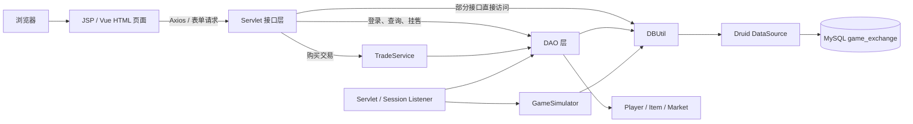
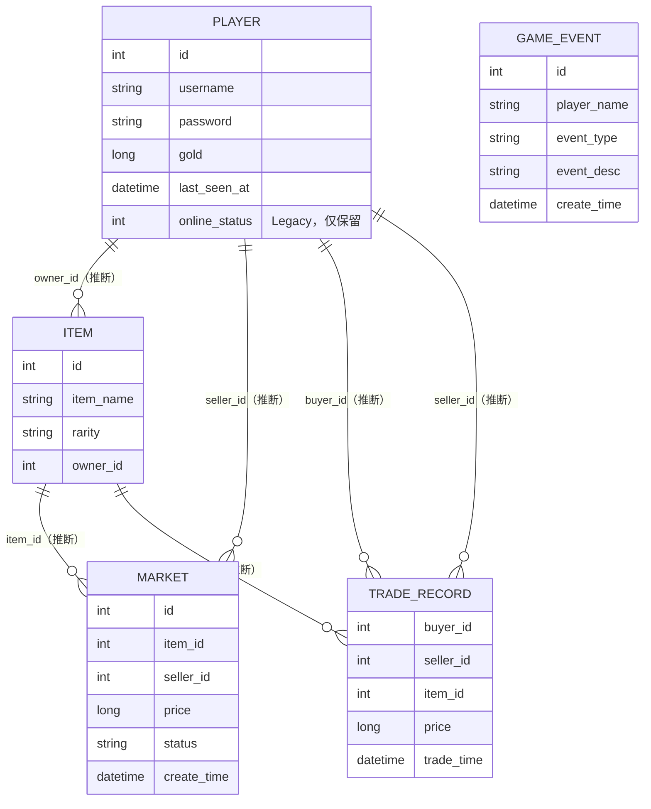

# GameExchange 项目代码审查报告

> Milestone：1.1 项目体检（Code Review）  
> 审查日期：2026-07-23  
> 审查目标：建立工程基线，不新增功能、不优化 UI、不修改业务逻辑

> 文档说明：本文前半部分保留 2026-07-23 的初始审查基线；后续 Phase 已验证的当前架构以“当前架构补充（Phase 4B.3）”为准。

## 1. 执行摘要

GameExchange 是一个基于 Java 17、Servlet 4、Tomcat 9、MySQL 和 Maven WAR 的游戏虚拟物品交易项目。项目已经形成登录注册、战斗奖励、物品持有、市场挂售、购买交易和数据大屏等主要业务闭环，并采用了 Druid 连接池、`PreparedStatement`、数据库事务和行锁等基础工程手段。

当前项目适合作为可运行的课程或演示项目，但尚未达到企业持续开发、稳定交付和直接容器化的要求。主要原因不是目录本身完全失控，而是以下工程基线尚未建立：

- 数据库凭据、地址、部署服务器和应用上下文存在硬编码。
- 构建产物同时来自 Maven `target/` 和 IntelliJ IDEA `out/`，缺少唯一构建来源。
- 缺少数据库 DDL 或迁移脚本，无法在新环境中重建数据结构。
- 缺少测试、统一日志、根目录忽略规则、README 和变更记录。
- 存在明文密码、客户端可控制战斗奖励等高风险安全问题。
- Servlet、Service、DAO 的分层执行不一致，异常和 JDBC 资源管理不统一。
- Session、Presence Lease、浏览器 `localStorage` 和后台线程会影响未来多容器部署。

**总体结论：先完成 Phase 1 工程整理，再设计安全整改、测试基线和 Docker。当前不建议直接用于生产环境，也不建议把现状原样封装进 Docker 镜像。**

## 2. 审查范围与方法

### 2.1 覆盖范围

本次审查覆盖全部人工维护源码和关键工程配置：

| 类型 | 文件数 | 约计行数 | 审查内容 |
| --- | ---: | ---: | --- |
| Java | 23 | 1,713 | Entity、DAO、Service、Servlet、Listener、Simulator、数据库工具 |
| HTML | 5 | 5,170 | 页面结构、内联样式、内联脚本、接口调用、运行时状态 |
| JSP | 1 | 29 | 应用入口和跳转逻辑 |
| JavaScript | 12 | 2,623 | 页面视觉脚本、页面切换、静态开发服务器 |
| CSS | 8 | 3,505 | 样式组织方式、重复覆盖、维护规模；不评价视觉效果 |
| 核心配置 | 3 | 135 | `pom.xml`、`druid.properties`、`deploy.bat` |
| IDE/产物 | 若干 | 不计 | `.idea/`、`target/`、`out/` 的工程影响和产物来源 |

`target/`、`out/` 中的 `.class` 和 WAR 属于生成物，本次检查其存在性和包内容，不把反编译结果当作源码重复审查。

### 2.2 审查方法

- 逐文件读取人工维护源码和配置。
- 根据包依赖、Servlet 路由、前端请求和 SQL 建立模块关系。
- 根据 Java 映射和 SQL 推断数据库逻辑关系。
- 搜索硬编码环境信息、凭据、日志输出、异常处理和重复实现。
- 对全部 12 个 JavaScript 文件执行 Node.js 语法检查。
- 检查现有 WAR 内容、Maven 编译元数据和 IntelliJ IDEA 构建产物来源。
- 对照 Maven 标准目录、Docker 构建原则和 OWASP 密码存储原则校准结论。

### 2.3 审查限制

- 项目没有数据库 DDL、迁移脚本或数据库设计文档，因此表结构、外键、索引、唯一约束和默认值只能根据代码推断。
- 当前环境可以使用 Java 17 和 Node.js，但找不到 `mvn` 命令，也没有 Maven Wrapper，无法重新执行 Maven 构建和测试。
- 当前环境找不到 `git` 命令，无法确认 `target/`、`out/`、`.idea/` 是否已经被 Git 跟踪，也无法提供可靠的工作区状态。
- 未连接 MySQL，未启动 Tomcat，未执行真实接口和并发交易测试。
- 已存在的 WAR 生成于 2026-06-28，只能证明当时存在构建产物，不能替代本次构建验证。

## 3. 技术栈与运行约束

| 层次 | 当前技术 | 版本或方式 | 结论与约束 |
| --- | --- | --- | --- |
| Java | JDK | 17 | `pom.xml` 与本机 Java 版本一致 |
| 构建 | Maven WAR | `packaging=war` | 标准 Maven 源码结构已具备，但没有 Wrapper |
| Web | Java Servlet API | `javax.servlet-api 4.0.1` | 对应 Tomcat 9；不能直接换成使用 `jakarta.*` 的 Tomcat 10+ |
| 容器 | Tomcat | 部署脚本指向 Tomcat 9 | 版本未被构建配置锁定，依赖外部服务器安装 |
| 数据库 | MySQL Connector/J | 8.4.0 | 数据库服务版本和初始化方式未知 |
| 连接池 | Druid | 1.2.23 | 配置打包在 WAR 内，包含环境信息和敏感信息 |
| JSON | Fastjson + Gson | 1.2.83 + 2.10.1 | 同一项目存在两套序列化方式和手写 JSON |
| 测试 | JUnit 5 + Mockito | 依赖已声明 | 没有 `src/test` 测试代码 |
| 前端 | Vue | Vue 2 CDN | URL 未锁定精确补丁版本，没有本地依赖清单 |
| HTTP | Axios | CDN 最新路径 | 未锁定版本，构建结果依赖外网当前内容 |
| 视觉 | Three.js + GSAP | 0.160.1 + 3.12.5 | 已锁定版本，但运行仍依赖 CDN |

### 3.1 兼容性重点

当前源码使用 `javax.servlet.*`。未来制作 Docker 镜像时，如果继续保持业务代码不变，应选择与 Servlet 4 兼容的 Tomcat 9 基础镜像；直接使用 Tomcat 10 或 11 会遇到 `javax.*` 与 `jakarta.*` 命名空间不兼容。迁移 Jakarta 应作为独立升级任务，不能混入目录整理或 Docker 首次实践。

## 4. 当前目录结构

```text
GameExchange/
├─ .idea/                         # IntelliJ IDEA 项目与本地工作区配置
├─ out/                           # IntelliJ IDEA 构建产物
│  └─ artifacts/.../*.war
├─ target/                        # Maven 历史构建产物与编译元数据
├─ src/
│  └─ main/
│     ├─ java/com/game/
│     │  ├─ dao/                  # 数据访问
│     │  ├─ entity/               # 数据实体
│     │  ├─ service/              # 交易业务服务
│     │  ├─ servlet/              # HTTP 接口
│     │  ├─ simulator/            # 模拟器与监听器
│     │  └─ util/                 # 数据库连接工具
│     ├─ resources/
│     │  └─ druid.properties      # 数据库与连接池配置
│     └─ webapp/
│        ├─ index.jsp             # 应用入口
│        └─ vue/                  # 页面、内联业务脚本和视觉资源
├─ tools/
│  └─ static-server.js            # 前端静态预览工具
├─ deploy.bat                     # 手工远程部署脚本
└─ pom.xml                        # Maven 配置
```

### 4.1 目录评价

优点：`src/main/java`、`src/main/resources`、`src/main/webapp` 符合 Maven Web 项目的常见布局，Java 包也已经按职责初步分层。

问题：源码、IDE 状态、两套构建产物和手工部署脚本混在项目目录中；根目录没有统一 `.gitignore`、README、数据库脚本或文档目录。Milestone 1.2 应在保留 Maven 标准结构的基础上清理边界，不需要搬动业务包或进行大型重构。

## 5. 模块关系



### 5.1 分层现状

| 模块 | 主要文件 | 当前职责 | 主要观察 |
| --- | --- | --- | --- |
| Entity | `Player`、`Item`、`Market` | 数据载体 | 结构简单；`Player` 持有密码字段 |
| DAO | 4 个 DAO | 玩家、物品、市场、交易记录访问 | 部分方法自管连接，部分接收事务连接；异常策略不一致 |
| Service | `TradeService` | 购买交易 | 正确使用事务和 `FOR UPDATE`，是当前最清晰的业务边界 |
| Servlet | 10 个 Servlet | 参数解析、Session、JSON 响应、部分业务逻辑 | 部分 Servlet 越过 Service/DAO 直接写 SQL |
| Simulator | 事件、调度器和监听器 | 启动时加载玩家并预留模拟任务 | 调度任务已注释，但线程池仍创建，日志仍显示任务已启动 |
| Util | `DBUtil` | 初始化 Druid、获取和归还连接 | 配置强绑定资源文件，日志和资源关闭不规范 |
| Frontend | 5 个 HTML 页面 | 页面、Vue 状态、接口调用、动画 | 每页同时包含大量内联 CSS 与 JS，公共配置重复 |

### 5.2 绕过分层的路径

- `BattleServlet` 直接通过 `DBUtil` 更新玩家金币、插入物品和事件。
- `PlayerItemsServlet` 直接执行物品查询 SQL。
- `StatsServlet` 直接执行六类统计 SQL。
- `GameSimulator` 直接读写数据库。

这不会立即导致项目无法运行，但会让连接管理、异常处理、日志、事务和测试方式分散。后续如果整理分层，应作为独立 Milestone，不能混入 Phase 1 的目录或配置修改。

## 6. HTTP 接口清单

| 方法 | 路径 | 实现 | 当前身份校验 | 数据访问 | 审查结论 |
| --- | --- | --- | --- | --- | --- |
| POST | `/register` | `RegisterServlet` | 无需登录 | `PlayerDao` | 参数有基础校验，但密码直接写入实体和数据库 |
| POST | `/login` | `LoginServlet` | 用户名与密码 | `PlayerDao` + `PresenceService` | 明文比较密码，成功后写 Session 并刷新 `last_seen_at` Lease |
| POST | `/logout` | `LogoutServlet` | 可选 Session | `PresenceService` | 清理 `last_seen_at` Lease 并销毁 Session |
| GET | `/market/list` | `MarketServlet` | Session | `MarketDao` | 返回在售列表，使用 Gson |
| GET | `/player/items` | `PlayerItemsServlet` | Session | 直接 JDBC | 身份来自 Session，资源关闭不完整 |
| GET | `/player/info` | `PlayerInfoServlet` | 无 | `PlayerDao` | 信任查询参数中的 `playerId`，缺少身份绑定 |
| POST | `/trade/sell` | `SellServlet` | Session | `ItemDao` + `MarketDao` | 校验和插入使用不同连接，存在并发窗口 |
| POST | `/trade/buy` | `TradeServlet` | Session | `TradeService` | 身份来自 Session；购买过程使用事务和行锁 |
| GET | `/stats` | `StatsServlet` | 无 | 直接 JDBC | 返回全局统计，设置 `Access-Control-Allow-Origin: *` |
| POST | `/battle/result` | `BattleServlet` | 无 | 直接 JDBC | 客户端可提交玩家 ID、金币和掉落，是最高风险接口 |

### 6.1 接口层共性问题

- 没有统一认证 Filter，各 Servlet 自行决定是否检查 Session。
- 没有统一异常处理和响应模型。
- JSON 同时使用 Fastjson、Gson 和字符串拼接。
- 响应体中的 `code` 与真实 HTTP Status 不一致，例如业务失败通常仍返回 HTTP 200。
- 修改状态的 Session 接口没有看到 CSRF 防护。
- 数字参数校验不一致，部分接口直接调用 `Integer.parseInt` 或 `Long.parseLong`。

## 7. 核心业务流程

### 7.1 登录

1. 页面向 `/login` 提交用户名和密码。
2. `PlayerDao.findByUsername` 查询包含密码的完整 `Player`。
3. `LoginServlet` 直接比较字符串密码。
4. 成功后把完整 `Player` 放入 Session，并通过 `PresenceService` 刷新 `last_seen_at`；在线租约 TTL 为 60 秒。
5. 前端同时把 `playerId`、`username`、`gold` 写入 `localStorage`。

风险在于密码存储方式，以及 Session、Lease 和浏览器状态之间的边界。`online_status` 仍保留在数据库中，但不再作为运行时在线事实来源。

### 7.2 挂售

1. 从 Session 获取卖家 ID。
2. `ItemDao.findById` 使用一个独立连接检查物品归属。
3. `MarketDao.addMarket` 使用另一个独立连接插入市场记录。

校验和写入不在同一事务中。并发请求可能在两步之间改变物品或市场状态，实际约束是否能兜底又因为缺少 DDL 无法确认。

### 7.3 购买

1. 从 Session 获取买家 ID。
2. `TradeService` 开启事务。
3. 使用 `SELECT ... FOR UPDATE` 锁定市场记录。
4. 校验商品状态、卖家、买家和余额。
5. 在同一连接内更新双方金币、物品所有者、市场状态并新增交易记录。
6. 成功提交，异常回滚。

这是当前项目中工程质量最好的一条流程。事务边界和行锁思路正确，但 DAO 内部 `PreparedStatement` 的关闭、异常传播和业务结果建模仍需后续改善。

### 7.4 战斗结算

`BattleServlet` 直接接受客户端提交的 `playerId`、`gold` 和 `loots`，没有读取 Session 身份，也没有在服务端计算或限制奖励。请求可以直接增加金币、生成物品和写事件记录。这属于业务完整性与安全问题，不应在工程整理中顺手修改，应单独设计、测试和验收。

### 7.5 模拟器

Tomcat 启动时，`SimulatorListener` 创建 `GameSimulator`；模拟器构造时创建 3 线程调度池并加载玩家。但三个 `scheduleAtFixedRate` 调用当前全部被注释，日志仍输出“所有任务已启动”。如果未来重新启用，多 Tomcat 或多 Docker 副本会各自启动一套模拟任务，造成重复写入。

## 8. 数据库关系

### 8.1 重要说明

以下表、字段和关系均由 Java 实体和 SQL 推断，不代表数据库中已经存在对应的主键、外键、索引、唯一约束或检查约束。



`GAME_EVENT` 只保存 `player_name`，代码中没有通过 `player_id` 建立关系，因此没有在图中画出实体关联。

### 8.2 数据库风险

- 没有 DDL 或迁移脚本，新环境无法可靠初始化数据库。
- 无法确认 `username` 是否唯一，相关外键是否存在，以及查询字段是否有索引。
- `password` 字段当前被作为可逆明文使用。
- `market.status`、`item.rarity` 和 `game_event.event_type` 使用字符串约定，数据库约束未知。
- `game_event` 保存玩家名而非玩家 ID，改名和审计关联能力弱。
- 统计查询依赖 `DATE(trade_time) = CURDATE()` 和若干排序/过滤字段，索引情况未知。
- 无法确认是否存在防止同一物品重复在售的唯一约束。

## 9. 已有的正确实践

本次审查不只记录问题。以下基础值得保留：

- 已使用 Maven 标准 Web 项目目录，没有必要整体重建项目。
- Java 和 Maven 编译目标统一为 17。
- SQL 参数普遍使用 `PreparedStatement`，降低了常见 SQL 注入风险。
- 大部分自管连接的 DAO 查询使用 try-with-resources。
- 购买流程使用同一连接、显式事务、回滚和 `FOR UPDATE`。
- 购买和挂售接口从 Session 读取交易身份，没有信任前端传入的买家或卖家 ID。
- `Player.toString()` 没有输出密码。
- 连接池参数已经集中在一个资源文件中，后续可以在此基础上做配置外部化。
- 全部 12 个 JavaScript 文件通过 Node.js 语法检查。

## 10. 技术债分级

### 10.1 优先级定义

| 等级 | 含义 | 处理原则 |
| --- | --- | --- |
| P0 | 可直接导致敏感信息泄露、越权或核心数据被篡改 | 在进入生产或公开网络前必须解决 |
| P1 | 阻碍可重复构建、可靠部署、数据一致性或故障定位 | Phase 1 后优先排期 |
| P2 | 显著增加维护成本、扩容风险或依赖不确定性 | 在架构稳定后逐项治理 |
| P3 | 代码风格、命名或局部整洁度问题 | 不单独发起大规模修改 |

### 10.2 技术债清单

| ID | 等级 | 问题 | 证据 | 影响 | 建议归属 |
| --- | --- | --- | --- | --- | --- |
| TD-01 | P0 | 数据库用户名和密码硬编码并打包进 WAR | `src/main/resources/druid.properties:2-4`，WAR 含该文件 | 凭据泄露；无法按环境配置 | Milestone 1.3；先轮换已暴露凭据 |
| TD-02 | P0 | 用户密码按明文写入和比较 | `RegisterServlet:60`、`LoginServlet:39`、`PlayerDao:76` | 数据库泄露后账号直接暴露 | 独立安全 Milestone，使用密码哈希并设计迁移 |
| TD-03 | P0 | 战斗结算信任客户端奖励且无 Session 校验 | `BattleServlet:24-35,62-63` | 任意玩家金币和物品可被篡改 | 独立业务安全 Milestone |
| TD-04 | P1 | 玩家信息接口信任任意 `playerId` | `PlayerInfoServlet:23-29` | 身份边界不清晰，可能越权读取 | 独立认证授权 Milestone |
| TD-05 | P1 | 缺少统一认证和 CSRF 策略 | Servlet 包中没有 Filter；各接口自行检查 Session | 新接口容易漏鉴权，状态修改接口可能被跨站调用 | 独立安全 Milestone |
| TD-06 | P1 | 没有 DDL、迁移脚本或种子数据说明 | 项目中不存在 `.sql` 和 migration 目录 | 新环境、Docker 和 CI 无法重建数据库 | 后续数据库基线步骤；文档先记录 |
| TD-07 | P1 | 部署脚本硬编码本机路径、公网服务器、root 和 Tomcat 路径，并执行删除 | `deploy.bat:4,8` | 不可移植，误操作和权限风险高 | 后续 Docker/CI/CD Milestone |
| TD-08 | P1 | Maven 与 IntelliJ 使用两套构建产物 | `pom.xml` 产物应在 `target/`；`deploy.bat:4` 使用 `out/` | 无法确定上线代码来源 | Milestone 1.2/1.5 建立唯一命令，后续 CI 固化 |
| TD-09 | P1 | 没有 Maven Wrapper，当前环境也没有 `mvn` | 根目录无 `mvnw*`，实际命令不可用 | 新开发机和 CI 工具版本不确定 | 后续构建基线步骤，不能在本报告中引入 |
| TD-10 | P1 | 测试依赖已声明但没有测试代码 | `pom.xml:61-79`，不存在 `src/test` | 重构、配置和容器化缺少回归保护 | 独立测试 Milestone |
| TD-11 | P1 | DAO 捕获异常后返回 `null` 或 `0` | `PlayerDao`、`ItemDao`、`MarketDao` 多处 `printStackTrace` | “数据不存在”和“数据库故障”无法区分 | Milestone 1.4 先规范日志，后续统一异常模型 |
| TD-12 | P1 | 多处 JDBC Statement/ResultSet 未关闭 | 事务型 DAO、`StatsServlet`、`PlayerItemsServlet`、`GameSimulator` | 连接池压力和长期资源泄漏 | 独立后端质量步骤 |
| TD-13 | P1 | 挂售校验和插入不在同一事务 | `SellServlet:64-75`、`MarketDao.addMarket` | 并发下可能重复挂售或状态过期 | 独立交易一致性 Milestone |
| TD-14 | P1 | Session、Presence Lease、`localStorage` 三套状态边界 | 登录、退出、Heartbeat 及 4 个业务页面 | 多副本和异常退出时仍需统一会话与客户端状态策略 | 在线事实已统一为 `last_seen_at` Lease；Redis 仍不在当前范围 |
| TD-15 | P1 | 每个应用副本都会创建模拟器线程池 | `SimulatorListener:15-19`、`GameSimulator:18-22` | 多容器会重复执行任务，增加关闭和伸缩风险 | Docker 前明确是否启用及单实例策略 |
| TD-16 | P1 | 业务日志使用 `System.out` 和 `printStackTrace` | `DBUtil`、Simulator、Service、DAO、Servlet | 无级别、上下文、统一格式，难以采集检索 | Milestone 1.4 |
| TD-17 | P2 | 应用上下文 `/GameExchange_war` 在页面和脚本中重复硬编码 | 5 个 HTML 第 5 行及各页 `GE_API_BASE` | WAR 改名或容器 Context 改变时页面失败 | Milestone 1.3 统一运行配置 |
| TD-18 | P2 | JSON 库和响应方式不统一 | `pom.xml:45-58`，Servlet 同时使用 Fastjson、Gson、字符串 | 行为、日期格式和维护方式不一致 | 后续依赖与 API 规范步骤 |
| TD-19 | P2 | 业务失败没有对应 HTTP Status | 多个 Servlet 只写响应体 `code` | 网关、监控和客户端难以判断真实结果 | 后续 API 规范步骤 |
| TD-20 | P2 | 页面文件过大并混合结构、样式和业务脚本 | 5 个 HTML 均为 933-1,153 行，内联 CSS 541-675 行 | 修改冲突和重复代码风险高 | 后续前端工程化；不做 UI 改造 |
| TD-21 | P2 | 公共 API Base 在 5 个页面和 `force-showcase.js` 重复 | 各页 `GE_API_BASE` 与 `force-showcase.js:11-20` | 修改点分散，配置容易漂移 | Milestone 1.3 或后续前端工程化 |
| TD-22 | P2 | 10 个视觉脚本当前没有页面引用 | 页面只引用 `force-showcase.js`；其余脚本路径引用数为 0 | 难以判断有效资产，增加维护认知成本 | Milestone 1.2 只分类记录；删除前必须单独确认 |
| TD-23 | P2 | 页面切换脚本动态执行抓取页面中的内联脚本 | `force-showcase.js:242-249` | 生命周期、异常栈和安全策略复杂 | 后续前端工程化；当前不改 UI 或交互 |
| TD-24 | P2 | Vue 和 Axios CDN 地址未锁定精确版本且无本地清单 | 5 个 HTML 的第 9-11 行附近 | 构建依赖外网，内容变化不可控 | 后续前端依赖基线 |
| TD-25 | P2 | `StatsServlet` 开放 `Access-Control-Allow-Origin: *` | `StatsServlet:23-25` | 数据边界依赖接口是否确实公开 | 独立安全评审后决定策略 |
| TD-26 | P2 | 根目录缺少 `.gitignore`，存在 IDE 和构建产物 | 仅 `.idea/.gitignore`；根目录存在 `.idea/`、`out/`、`target/` | 仓库可能包含本地状态和大体积二进制 | Milestone 1.2 |
| TD-27 | P2 | 缺少 README、CHANGELOG 和维护文档 | 根目录不存在相应文件 | 新成员无法独立构建、运行和理解项目 | Milestone 1.5、1.6 |
| TD-28 | P3 | 模拟器任务已注释但仍输出“已启动” | `GameSimulator:60-77` | 日志与真实运行状态不一致 | Milestone 1.4 记录，业务是否启用需另行确认 |

## 11. 前端工程现状

本节只评估可维护性，不评价或修改 UI 设计。

| 页面 | 总行数 | 内联 CSS | 内联 JS | 调用接口数 |
| --- | ---: | ---: | ---: | ---: |
| `battle.html` | 1,090 | 675 | 252 | 2 |
| `dashboard.html` | 933 | 641 | 121 | 2 |
| `login.html` | 948 | 594 | 154 | 2 |
| `market.html` | 1,153 | 541 | 417 | 6 |
| `register.html` | 1,046 | 608 | 243 | 1 |

观察结论：

- 五个页面都是“单文件页面”，同时承担布局、样式、Vue 状态、接口请求和动画初始化。
- 已存在公共 CSS 文件，但页面仍有大量内联 CSS，覆盖层中大量使用 `!important`。
- `market.html` 的业务脚本规模最大，集中处理市场筛选、物品、购买、挂售、玩家信息和退出。
- 页面都重复加载 Vue、Axios、Three.js、GSAP，并重复声明 API Base。
- `force-showcase.js` 同时承担 API Base、SPA 式页面切换、脚本执行、动画和 Three.js 场景，职责过多。
- 未被页面引用的视觉脚本不能直接认定为可删除文件，必须在 Milestone 1.2 中先确认来源和保留策略。

## 12. Docker 就绪度评估

### 12.1 当前结论

**当前 Docker 就绪度不足。** 主要问题不是缺少一个 `Dockerfile`，而是构建、配置、数据库、日志和运行状态尚未形成可移植约定。此时直接写 Dockerfile，只会把本机假设和敏感配置一起固化到镜像中。

### 12.2 前置项

| 领域 | 当前状态 | 进入 Docker 后的问题 | 推荐前置动作 |
| --- | --- | --- | --- |
| 构建 | Maven 与 IDEA 双产物，无 Wrapper | 镜像内不知道应复制哪个 WAR | 确立唯一 Maven 构建命令和产物 |
| 数据库地址 | 使用 `127.0.0.1` | 容器内指向应用容器自身，不是 MySQL 容器 | Milestone 1.3 支持环境变量或外部配置覆盖 |
| 数据库凭据 | 写入资源并进入 WAR | 密钥进入镜像层，难以轮换 | 凭据不入库、不入镜像，通过运行环境注入 |
| 数据库结构 | 无 DDL/迁移 | MySQL 容器启动后没有可靠表结构 | 建立可版本化数据库基线 |
| Tomcat | 外部服务器手工安装 | 镜像版本和 Servlet 兼容性不确定 | 明确使用 Tomcat 9 或独立规划 Jakarta 迁移 |
| Context Path | 固定 `/GameExchange_war` | WAR 改名或部署为 ROOT 时前端请求失败 | 统一上下文配置或固定部署约定 |
| 日志 | `System.out`/堆栈散落 | 容器日志缺少级别和请求上下文 | Milestone 1.4 统一日志规范 |
| Session | 进程内 Session | 多副本请求切换后会丢登录状态 | 首个 Docker Milestone 可先单实例；扩容前再评估粘性会话或 Redis |
| 在线状态 | `last_seen_at` Lease；登录和 Heartbeat 刷新，登出和 Session 销毁清理 | 依赖租约 TTL，强制终止后最多保留 60 秒 | 当前正式方案；`online_status` 仅保留为 Legacy 字段 |
| 模拟任务 | 每个 Web 应用实例创建线程池 | 每个容器都会重复创建和执行任务 | 容器化前明确启停配置与单实例执行策略 |
| 部署 | root SSH + 删除旧 WAR | 无回滚、无制品校验、风险高 | Docker 稳定后再由 CI/CD 替代 |

### 12.3 Redis 是否现在需要

当前 Phase 1 不需要为了“技术栈完整”强行引入 Redis。单实例 Tomcat 可以继续使用本地 Session。只有当项目明确需要多个应用副本、会话共享、缓存或分布式协调时，Redis 才有真实需求。在此之前，应先完成配置、日志、测试和数据库基线，否则 Redis 只会增加新的运维复杂度。

## 13. Phase 1 后续建议

以下仅为建议顺序，不代表已经授权执行：

### Milestone 1.2：项目目录规范

- 保留现有 Maven 标准源码结构。
- 建立根目录忽略规则，明确 `.idea/`、`out/`、`target/` 的边界。
- 确认未引用视觉脚本的来源；未经确认不删除。
- 明确 Maven 为唯一交付产物来源。

### Milestone 1.3：配置抽离

- 轮换当前已进入项目和 WAR 的数据库凭据。
- 将数据库参数与连接池参数按职责整理。
- 提供不含真实凭据的配置模板。
- 支持环境变量或外部文件覆盖，不能只是把 `druid.properties` 改名为 `db.properties` 后继续把真实值打包进 WAR。
- 统一应用 Context Path 的配置来源。

### Milestone 1.4：日志规范

- 在不引入新日志框架的前提下统一日志入口、级别、格式和异常记录。
- 禁止业务代码继续直接使用 `System.out` 和 `printStackTrace()`。
- 明确哪些字段属于敏感信息，日志不得输出密码和完整凭据。

### Milestone 1.5：README

- 写清项目用途、技术栈、前置环境、构建命令、Tomcat 部署、数据库前置条件和目录说明。
- 对当前无法自动化的步骤明确标注，不虚构“一键运行”。

### Milestone 1.6：文档建立

- 建立 `docs/` 和文档索引。
- 建立 `CHANGELOG`，记录每个 Milestone 的真实变更和验证结果。
- 补充数据库逻辑模型和已知运行约束，但 DDL 应在单独确认后建立。

### Phase 1 之后

- 安全基线：密码哈希、战斗结算可信边界、认证 Filter、CSRF、CORS。
- 测试基线：优先覆盖购买事务、挂售一致性、登录和战斗结算。
- 构建基线：Maven Wrapper、可重复 WAR、依赖检查。
- 数据库基线：DDL/迁移、索引、约束和初始化流程。
- 完成上述前置项后，再进入 Docker 单实例实践。

## 14. 验证记录

| 检查项 | 实际结果 |
| --- | --- |
| JavaScript 语法 | 12/12 文件通过 `node --check` |
| Java 版本 | 本机 `java`/`javac` 为 17.0.12，与 `pom.xml` 目标一致 |
| Maven 构建 | 未执行：当前环境没有 `mvn`，项目也没有 Maven Wrapper |
| Maven 测试 | 未执行：同上；项目不存在测试源码 |
| Tomcat 启动 | 未执行：本次未获得可用数据库和完整启动参数 |
| 数据库验证 | 未执行：项目没有 DDL，也未连接数据库 |
| WAR 检查 | `out/artifacts` 中存在 WAR，包含 23 个源码对应的类及 `druid.properties`；该产物不是本次重新构建 |
| Git 状态 | 未验证：当前环境没有 `git` 命令 |
| 本 Milestone 变更范围 | 仅新增 `CODE_REVIEW.md`，未修改源码、配置、UI 或业务逻辑 |

## 15. 审查覆盖清单

### 15.1 Java

- `dao/ItemDao.java`
- `dao/MarketDao.java`
- `dao/PlayerDao.java`
- `dao/TradeRecordDao.java`
- `entity/Item.java`
- `entity/Market.java`
- `entity/Player.java`
- `service/TradeService.java`
- `servlet/BattleServlet.java`
- `servlet/LoginServlet.java`
- `servlet/LogoutServlet.java`
- `servlet/MarketServlet.java`
- `servlet/PlayerInfoServlet.java`
- `servlet/PlayerItemsServlet.java`
- `servlet/RegisterServlet.java`
- `servlet/SellServlet.java`
- `servlet/StatsServlet.java`
- `servlet/TradeServlet.java`
- `simulator/GameEvent.java`
- `simulator/GameSimulator.java`
- `simulator/SessionListener.java`
- `simulator/SimulatorListener.java`
- `util/DBUtil.java`

### 15.2 页面与前端资源

- `index.jsp`
- `vue/login.html`
- `vue/register.html`
- `vue/dashboard.html`
- `vue/market.html`
- `vue/battle.html`
- `vue/assets/js/neo-visuals.js`
- `vue/assets/js/neo3d/animation.js`
- `vue/assets/js/neo3d/camera.js`
- `vue/assets/js/neo3d/fallback.js`
- `vue/assets/js/neo3d/force-showcase.js`
- `vue/assets/js/neo3d/lights.js`
- `vue/assets/js/neo3d/main.js`
- `vue/assets/js/neo3d/particles.js`
- `vue/assets/js/neo3d/postfx.js`
- `vue/assets/js/neo3d/scene.js`
- `vue/assets/js/neo3d/shader.js`
- `vue/assets/css/` 下全部 8 个 CSS 文件
- `tools/static-server.js`

### 15.3 工程文件

- `pom.xml`
- `deploy.bat`
- `src/main/resources/druid.properties`（敏感值已在审查输出中脱敏）
- `.idea/` 中的编译、编码、Maven 仓库、Web Context 和 WAR Artifact 配置
- `target/` 中的 Maven 编译元数据和历史类文件
- `out/artifacts/` 中的 IntelliJ IDEA WAR

### 15.4 当前架构补充（Phase 4B.3）

以下内容反映 Phase 3A～3F、Phase 4B.1 和 Phase 4B.2 完成后的当前状态，优先于本文早期审查基线中的在线状态描述：

- **在线事实来源**：`player.last_seen_at` 是唯一 Presence 运行时写路径和 `/stats.onlineCount` 读取依据。
- **Lease 规则**：登录成功和已登录 Heartbeat 刷新 `last_seen_at`；Lease TTL 为 60 秒。登出和 Session 销毁清理该租约。
- **Stats**：`/stats.onlineCount` 使用 `last_seen_at >= CURRENT_TIMESTAMP - INTERVAL 60 SECOND` 查询，Legacy 查询和 Shadow Verification 已移除。
- **`online_status` 边界**：数据库字段仍保留，尚未进入 Phase 4C 的 schema 清理；Java Entity、DAO 和业务代码不再依赖或写入该字段。
- **历史记录**：Phase 3A～3F 在 `CHANGELOG.md` 中保留为迁移过程记录，不代表当前运行时读写路径。

## 16. 参考规范

- [Apache Maven：Standard Directory Layout](https://maven.apache.org/guides/introduction/introduction-to-the-standard-directory-layout.html)
- [Docker：Building best practices](https://docs.docker.com/build/building/best-practices/)
- [OWASP：Password Storage Cheat Sheet](https://cheatsheetseries.owasp.org/cheatsheets/Password_Storage_Cheat_Sheet.html)
- [Apache Maven Archetypes：maven-archetype-webapp](https://github.com/apache/maven-archetypes/tree/master/maven-archetype-webapp)

## 17. 最终结论

GameExchange 已经具备清晰可识别的核心业务和 Maven Web 项目基础，不需要推倒重来。企业化升级的正确方向是保留现有业务行为，先建立仓库边界、唯一构建方式、外部配置、统一日志和可接手文档，再处理安全、测试、数据库版本化和容器化。

本报告完成后应停止在 Milestone 1.1，等待确认，不自动进入 Milestone 1.2。
