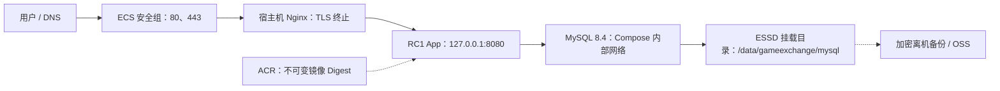

# GameExchange Phase 6.1-A 单 ECS 生产部署基线

## 1. 文档信息

| 项目 | 内容 |
| --- | --- |
| 适用版本 | `GameExchange 1.0.0-rc1` |
| 部署形态 | 单台阿里云 ECS，宿主机 Nginx，Docker Compose 运行 App 与 MySQL，MySQL 目录绑定到 ESSD |
| 文档目标 | 建立可部署、可验证、可回滚的低流量生产基线 |
| 非目标 | 高可用、自动扩缩容、Redis、Kubernetes、CI/CD、生产压测 |

本文档只定义 Phase 6.1-A 的生产部署基线。单 ECS 仍然存在节点级单点故障，不能据此宣称系统已经具备高可用能力。有明确 SLA、不可接受停机或不可接受本地数据库丢失风险时，应停止使用本方案，并单独设计 ECS + SLB + RDS 或其他高可用架构。

## 2. 已批准的 RC1 制品边界

生产部署必须使用已经通过 Release Gate 的 RC1 制品，不得在 ECS 上执行 Maven 构建或 `docker build`。

| 制品 | 已批准身份 |
| --- | --- |
| Git Tag | `v1.0.0-rc1` |
| Artifact Commit | `6cc2c88dd01bd6aea29f4e58d591031e6275079e` |
| WAR | `target/GameExchange_war-1.0.0-rc1.war` |
| WAR SHA-256 | `C27AF41FC6B52C842E7AD687F1B6C176DEB1A88558E41C6BBCBF24A4D758F452` |
| 已验证本地镜像 | `gameexchange-rc:1.0.0-rc1-6cc2c88dd01b-20260801-194735-296-859df335` |
| 已验证镜像 ID | `sha256:bae834eaf90a8dbb15a154524f0ace9ae8b4e5247469f39b8f9d333e35703ba2` |
| 新环境 Schema SHA-256 | `F915D672C7C6DD3F9CB0E4B96B96F9E936198E264A69CB1EC52B541F268C5541` |

ACR 的 Registry Manifest Digest 与本地镜像 ID 是不同层次的标识。发布到 ACR 后，应先按 Digest 拉取，再确认拉取结果的镜像 ID 仍等于上述已验证镜像 ID。`docker-compose.prod.yaml` 的 `APP_IMAGE` 必须使用 `registry/repository@sha256:<digest>`，不能使用可移动的 `latest` 或普通 Tag。

## 3. 架构设计



### 3.1 组件职责

| 组件 | 职责 | 边界 |
| --- | --- | --- |
| ECS 安全组 | 控制进入主机的网络流量 | 公网只开放 `80/443`；`22` 只允许可信管理地址 |
| 宿主机 Nginx | TLS、HTTP 到 HTTPS 跳转、反向代理、基础安全响应头 | 不直接访问 MySQL，不保存应用密码 |
| App 容器 | 运行已批准 RC1 镜像 | 只发布到宿主机 `127.0.0.1:8080` |
| MySQL 容器 | 保存业务数据 | 不发布宿主机端口，只允许 Compose 内部网络访问 |
| ESSD Bind Mount | 保存 MySQL 数据目录 | Compose 强制读取 `MYSQL_DATA_DIR`，并绑定到 `/var/lib/mysql` |
| ACR | 分发已批准镜像 | 生产引用 Registry Digest，不使用可移动 Tag |
| OSS 或等价离机存储 | 保存加密数据库备份 | 必须与 ECS 数据盘隔离，并执行恢复演练 |

### 3.2 为什么本阶段不引入 Redis 和 Kubernetes

当前应用仍使用单实例内存 Session，尚未具备多实例 Session 共享契约。Redis 只有在明确设计共享 Session、缓存或分布式协调后才有真实需求。Kubernetes 不能自动解决 Session、数据库和备份问题，当前引入只会增加调度、网络、存储和排错复杂度。因此 Phase 6.1-A 保持单应用实例，Redis 与 Kubernetes 留给独立 Milestone 评审。

## 4. ECS 资源与网络建议

以下规格是初始工程估算，不是容量测试结果：

- Linux x86_64 ECS，建议从 `2 vCPU / 8 GiB` 内存开始。
- 使用 ESSD 或等价数据盘，并将其持久挂载到 `/data`；MySQL 固定使用 `/data/gameexchange/mysql`。
- 配置固定公网入口和正式域名解析。
- 安全组公网入方向只允许 `80/tcp`、`443/tcp`。
- `22/tcp` 只允许公司出口 IP、堡垒机或其他受控管理入口。
- 不开放 `8080/tcp`、`3306/tcp`。
- Docker Engine、Docker Compose v2 和 `jq` 应按目标 Linux 发行版的官方安装方法安装，并在部署前记录版本。
- Nginx 和证书客户端运行在宿主机，Docker daemon 设置为开机启动。

真实规格必须在生产流量测试和至少一周资源观测后复核。CPU、内存、磁盘使用率或连接池等待时间接近告警阈值时，不应只纵向扩容，还要分析慢查询、连接数和请求模式。

## 5. 生产文件布局

ECS 建议只保存部署所需文件，不在服务器上构建源码：

```text
/opt/gameexchange/
├── docker-compose.prod.yaml
├── database/
│   └── schema.sql
├── config/
│   └── prod.env
└── secrets/
    ├── mysql_app_password
    └── mysql_root_password

/data/gameexchange/
└── mysql/

/etc/nginx/conf.d/
└── gameexchange.conf
```

### 5.1 部署用户模型

ECS 使用一个普通运维账号登录，该账号只通过受控 `sudo` 执行 Docker 和系统管理命令，不加入 `docker` 组。Docker 组等价于宿主机 root 权限，不应为了少写 `sudo` 而授予普通账号。

本基线中的 Compose 执行用户统一为 root，因此：

- 所有 ECS 上的 Docker/Compose 命令都使用 `sudo docker ...`。
- `prod.env` 由 `root:root` 持有并使用 `0600`，与 Compose 执行用户一致。
- `mysql_root_password` 由 `root:root` 持有并使用 `0600`。
- `mysql_app_password` 由 `root:10001` 持有并使用 `0640`，使 RC1 App 的固定 GID `10001` 只能读取该文件。
- 不使用 Compose Secret 的 `uid/gid/mode` 声明代替宿主机权限；文件型 Secret 底层是 Bind Mount，必须验证真实宿主机权限。

若 Docker daemon 启用了 User Namespace Remapping，宿主机 GID `10001` 可能不再对应容器 GID `10001`。此时必须根据实际映射重新设计权限并完成容器内读取验证，不能直接套用以下命令。

### 5.2 目录和文件权限

```bash
sudo install -d -o root -g root -m 0750 /opt/gameexchange
sudo install -d -o root -g root -m 0750 /opt/gameexchange/database
sudo install -d -o root -g root -m 0700 /opt/gameexchange/config
sudo install -d -o root -g root -m 0700 /opt/gameexchange/secrets
sudo install -d -o root -g root -m 0700 /data/gameexchange/mysql

sudo install -o root -g root -m 0600 /dev/null /opt/gameexchange/config/prod.env
sudo install -o root -g 10001 -m 0640 /dev/null /opt/gameexchange/secrets/mysql_app_password
sudo install -o root -g root -m 0600 /dev/null /opt/gameexchange/secrets/mysql_root_password
```

使用 `sudoedit` 填写配置和密码，避免密码进入 Git、Shell History 或命令行参数。编辑后重新执行 `chown` 和 `chmod`，防止编辑器替换文件时改变权限。两个密码必须不同，并由密码管理器生成和保存。具备宿主机 root 或 Docker 管理权限的人员仍可能读取容器内 Secret，这是单机 Compose 的安全边界。

宿主机权限检查：

```bash
sudo stat -c '%u:%g %a %n' \
  /opt/gameexchange/config/prod.env \
  /opt/gameexchange/secrets/mysql_app_password \
  /opt/gameexchange/secrets/mysql_root_password
```

预期依次为 `0:0 600`、`0:10001 640`、`0:0 600`。任何不一致都必须先修复，不能通过把 Secret 改成全局可读绕过权限问题。

## 6. 发布已批准镜像到 ACR

本步骤在仍保存已验证 RC1 镜像的发布工作站执行。不要重新构建镜像。

```bash
APPROVED_SOURCE_IMAGE="gameexchange-rc:1.0.0-rc1-6cc2c88dd01b-20260801-194735-296-859df335"
ACR_REGISTRY="registry.example.com"
ACR_TAG="registry.example.com/namespace/gameexchange:1.0.0-rc1"
ACR_DIGEST_REF="registry.example.com/namespace/gameexchange@sha256:REPLACE_WITH_REGISTRY_MANIFEST_DIGEST"

read -r -p "ACR username: " ACR_USERNAME
read -r -s -p "ACR password or temporary token: " ACR_PASSWORD
printf '\n'
printf '%s' "$ACR_PASSWORD" \
  | docker login "$ACR_REGISTRY" --username "$ACR_USERNAME" --password-stdin
unset ACR_PASSWORD

docker image inspect "$APPROVED_SOURCE_IMAGE" --format '{{.Id}}'
docker tag "$APPROVED_SOURCE_IMAGE" "$ACR_TAG"
docker push "$ACR_TAG"
docker pull "$ACR_DIGEST_REF"
docker image inspect "$ACR_DIGEST_REF" --format '{{.Id}}'
```

`registry.example.com/namespace` 只是格式示例，必须替换成实际 ACR 地址和命名空间。`REPLACE_WITH_REGISTRY_MANIFEST_DIGEST` 必须替换为 ACR Push 结果或 ACR 控制台记录的完整 64 位十六进制 Digest。

发布前后的 `docker image inspect` 都必须返回：

```text
sha256:bae834eaf90a8dbb15a154524f0ace9ae8b4e5247469f39b8f9d333e35703ba2
```

不一致时必须停止部署，检查是否推送了错误镜像、发生了重新构建或引用了多架构 Manifest 中的其他平台镜像。

### 6.1 ECS 拉取授权

ECS 必须使用组织批准的最小权限 ACR 拉取身份。优先使用可轮换的临时凭据或组织统一的 Registry Credential Helper；若当前只能使用账号密码，则凭据必须来自密码管理器，并通过标准输入传给以 root 运行的 Docker CLI：

```bash
ACR_REGISTRY="registry.example.com"
read -r -p "ACR pull username: " ACR_PULL_USERNAME
read -r -s -p "ACR pull password or temporary token: " ACR_PULL_PASSWORD
printf '\n'
printf '%s' "$ACR_PULL_PASSWORD" \
  | sudo docker login "$ACR_REGISTRY" --username "$ACR_PULL_USERNAME" --password-stdin
unset ACR_PULL_PASSWORD
```

因为生产 Compose 由 root 执行，ECS 的登录信息必须对 root Docker Context 生效。不要把 ACR 密码写入 `prod.env`、Compose 或 Shell History。

登录后按不可变 Digest 拉取并核对镜像 ID：

```bash
sudo docker pull "registry.example.com/namespace/gameexchange@sha256:REPLACE_WITH_REGISTRY_MANIFEST_DIGEST"
sudo docker image inspect \
  "registry.example.com/namespace/gameexchange@sha256:REPLACE_WITH_REGISTRY_MANIFEST_DIGEST" \
  --format '{{.Id}}'
```

镜像 ID 必须等于 `sha256:bae834eaf90a8dbb15a154524f0ace9ae8b4e5247469f39b8f9d333e35703ba2`。

### 6.2 ACR 凭据轮换

1. 在旧凭据失效前创建或获取新的最小权限 Pull 凭据。
2. 使用新凭据执行 `sudo docker login`。
3. 重新拉取当前 Digest，并再次验证镜像 ID。
4. 执行一次只读 `sudo docker compose ... config` 和 `pull app` 验证。
5. 撤销旧凭据，记录轮换人、时间和验证证据。
6. 失败时恢复仍有效的旧凭据，不得改用匿名仓库或放宽仓库公开权限。

## 7. 准备部署配置

### 7.1 非敏感环境文件

`/opt/gameexchange/config/prod.env` 只保存非敏感变量：

```dotenv
APP_IMAGE=registry.example.com/namespace/gameexchange@sha256:REPLACE_WITH_REGISTRY_MANIFEST_DIGEST
MYSQL_USER=gameexchange_app
MYSQL_DATA_DIR=/data/gameexchange/mysql
SECRETS_DIR=/opt/gameexchange/secrets
```

示例地址和 Digest 必须替换为 ACR 的真实不可变引用。`APP_IMAGE` 缺失时 Compose 会直接报错，防止误用开发镜像。密码不得写入该文件。

仅替换 Secret 文件不会修改 MySQL 中已经保存的账号密码。密码轮换必须在维护窗口内协调完成数据库账号修改、Secret 文件原子替换和 App 重建，并验证旧密码失效；不得只改文件后直接重启服务。

### 7.2 ESSD 数据盘与 Bind Mount

先在 ECS 控制台确认 ESSD 已附加到目标实例，再由管理员核对设备名、文件系统和是否包含历史数据。格式化磁盘会删除数据，本文不提供可直接复制的格式化命令；只有确认是全新空盘并完成变更审批后才能创建文件系统。

ESSD 必须通过文件系统 UUID 配置开机自动挂载到 `/data`。部署前执行：

```bash
findmnt -T /data/gameexchange/mysql
df -hT /data/gameexchange/mysql
sudo test -d /data/gameexchange/mysql
sudo test -w /data/gameexchange/mysql
```

`findmnt` 的来源设备必须是已批准 ESSD，不能是 ECS 系统盘、临时盘或 OverlayFS。`MYSQL_DATA_DIR` 必须精确设置为 `/data/gameexchange/mysql`。生产 Compose 直接把该目录绑定到 `/var/lib/mysql`，不再创建普通 Docker Named Volume。

Compose 渲染后应确认 Bind Mount 来源：

```bash
sudo docker compose \
  --env-file /opt/gameexchange/config/prod.env \
  -f /opt/gameexchange/docker-compose.prod.yaml \
  config
```

容器启动后执行：

```bash
MYSQL_CONTAINER_ID="$(sudo docker compose \
  --env-file /opt/gameexchange/config/prod.env \
  -f /opt/gameexchange/docker-compose.prod.yaml \
  ps -q mysql)"

sudo docker inspect "$MYSQL_CONTAINER_ID" \
  --format '{{range .Mounts}}{{println .Type .Source .Destination}}{{end}}'
```

输出必须包含 `bind /data/gameexchange/mysql /var/lib/mysql`。任何其他来源都必须停止部署。

### 7.3 数据库初始化边界

生产 Compose 只挂载 `database/schema.sql`，不会加载开发 Seed。该脚本只在 ESSD 数据目录第一次初始化且目录为空时执行。

部署前验证 Schema：

```bash
sha256sum /opt/gameexchange/database/schema.sql
```

预期 SHA-256：

```text
F915D672C7C6DD3F9CB0E4B96B96F9E936198E264A69CB1EC52B541F268C5541
```

已有数据库不会因容器重启重新执行初始化脚本。存量数据库升级必须按 `DATABASE_MIGRATION.md` 核对当前版本、备份和 Migration 记录，不得通过清空 Volume 伪装成新环境。

### 7.4 Nginx、证书与自动续期

1. 把 `deploy/nginx/gameexchange.conf` 中的 `gameexchange.example.com` 全部替换为正式域名。
2. DNS 应先解析到 ECS 公网入口。
3. 在启用该配置前获取正式证书，例如使用证书客户端的 Standalone 模式；证书必须存在于配置声明的路径。
4. 私钥只允许 root 和 Nginx 读取。
5. HTTPS 验证完成并确认域名长期启用后，再单独评审 HSTS；首次部署不直接开启，避免错误证书或域名配置被浏览器长期缓存。

证书客户端必须启用自动续期。不同 Linux 发行版的 Timer 名称可能不同，应先查询实际 Unit，再启用对应 Timer：

```bash
sudo systemctl list-unit-files | grep -E 'certbot.*timer|acme.*timer'
sudo systemctl enable --now ACTUAL_CERTIFICATE_RENEWAL_TIMER
```

创建续期成功后的 Nginx Reload Hook，例如 `/etc/letsencrypt/renewal-hooks/deploy/reload-nginx.sh`：

```sh
#!/bin/sh
set -eu
/usr/sbin/nginx -t
/bin/systemctl reload nginx
```

该脚本必须由 `root:root` 持有并使用 `0755`。启用后执行真实 Dry Run：

```bash
sudo certbot renew --dry-run
```

Dry Run 必须成功，并确认 Hook 中的 `nginx -t` 和 reload 都执行成功。证书到期监控至少提前 30 天告警，可使用以下命令作为监控数据源：

```bash
sudo openssl x509 -checkend 2592000 -noout \
  -in /etc/letsencrypt/live/gameexchange.example.com/fullchain.pem
```

返回非零表示证书将在 30 天内到期，应立即告警，不得等到续期失败后再人工发现。

Nginx 官方反向代理与 TLS 参考：

- <https://docs.nginx.com/nginx/admin-guide/web-server/reverse-proxy/>
- <https://docs.nginx.com/nginx/admin-guide/security-controls/terminating-ssl-http/>

## 8. 首次部署步骤

以下关键操作由部署人员在 ECS 上执行并保存输出，AI 负责复核结果。

### 8.1 部署前检查

```bash
sudo docker version
sudo docker compose version
nginx -v
sudo systemctl is-enabled docker
sudo systemctl is-active docker
sudo ss -lntp
```

确认 `80`、`443`、`8080` 没有被未知进程占用，`3306` 没有公网监听。

### 8.2 验证 Secret 和数据盘

```bash
sudo stat -c '%u:%g %a %n' \
  /opt/gameexchange/config/prod.env \
  /opt/gameexchange/secrets/mysql_app_password \
  /opt/gameexchange/secrets/mysql_root_password

findmnt -T /data/gameexchange/mysql
df -hT /data/gameexchange/mysql
```

先完成 Compose 渲染和 App Digest 拉取，再验证 RC1 App 容器的真实 Secret 可见性：

```bash
sudo docker compose \
  --env-file /opt/gameexchange/config/prod.env \
  -f /opt/gameexchange/docker-compose.prod.yaml \
  run --rm --no-deps --entrypoint /bin/sh app -ec '
    test "$(id -u)" = "10001"
    test "$(id -g)" = "10001"
    test -r /run/secrets/mysql_app_password
    test ! -e /run/secrets/mysql_root_password
  '
```

命令 Exit Code 必须为 `0`。这同时证明 App 使用 UID/GID 10001、能够读取 App Secret，并且没有获得 Root Secret。验证失败时不得通过 `chmod 0644` 或改为 root 运行 App 绕过问题。

### 8.3 渲染并检查 Compose

```bash
cd /opt/gameexchange
sudo docker compose \
  --env-file /opt/gameexchange/config/prod.env \
  -f docker-compose.prod.yaml \
  config
```

检查渲染结果时确认：

- App 使用 `@sha256:` Registry Digest，且不存在 `build`。
- App 只映射 `127.0.0.1:8080`。
- MySQL 没有 `ports`。
- Secret 来源是 `/opt/gameexchange/secrets`。
- MySQL 的 `/var/lib/mysql` 来源是 `/data/gameexchange/mysql`。
- MySQL 只加载 `01-schema.sql`，不存在 Seed 挂载。

### 8.4 启动服务

```bash
sudo docker compose \
  --env-file /opt/gameexchange/config/prod.env \
  -f /opt/gameexchange/docker-compose.prod.yaml \
  pull app

sudo docker compose \
  --env-file /opt/gameexchange/config/prod.env \
  -f /opt/gameexchange/docker-compose.prod.yaml \
  up -d

sudo docker compose \
  --env-file /opt/gameexchange/config/prod.env \
  -f /opt/gameexchange/docker-compose.prod.yaml \
  ps
```

预期 MySQL 和 App 最终都显示 `healthy`。未达到健康状态时，先查看对应服务日志，不得继续启用公网流量。

### 8.5 启用 Nginx

```bash
sudo nginx -t
sudo systemctl reload nginx
sudo systemctl status nginx --no-pager
```

`nginx -t` 必须成功后才能 reload。证书路径、域名或上游端口错误时不得绕过检查。

## 9. 上线验证

### 9.1 容器与镜像身份

```bash
sudo docker compose \
  --env-file /opt/gameexchange/config/prod.env \
  -f /opt/gameexchange/docker-compose.prod.yaml \
  ps

APP_IMAGE="$(sudo sed -n 's/^APP_IMAGE=//p' /opt/gameexchange/config/prod.env)"
sudo docker image inspect "$APP_IMAGE" --format '{{.Id}}'
```

镜像 ID 必须等于 RC1 已批准镜像 ID。不要只核对 Tag 名称。

### 9.2 HTTP 与 HTTPS

```bash
PRODUCTION_DOMAIN="gameexchange.example.com"

curl --head "http://$PRODUCTION_DOMAIN/vue/login.html"
curl --fail --show-error --silent "https://$PRODUCTION_DOMAIN/vue/login.html" > /dev/null
curl --fail --show-error --silent "https://$PRODUCTION_DOMAIN/vue/assets/js/app-config.js" > /dev/null
curl --fail --show-error --silent "https://$PRODUCTION_DOMAIN/stats"
```

预期结果：

- HTTP 返回 `308`，并跳转到同域名 HTTPS。
- 登录页和静态配置返回 HTTP `200`。
- `/stats` 返回 HTTP `200`，响应中的业务 `code` 为 `200`。
- 浏览器证书链有效，域名匹配，不出现 Mixed Content。

### 9.3 网络暴露

```bash
sudo ss -lntp
```

宿主机应看到 Nginx 监听 `80/443`，应用只监听 `127.0.0.1:8080`。还应从 ECS 外部确认 `8080`、`3306` 无法连接，不能只依赖主机本地结果。

### 9.4 重启恢复

在维护窗口内分别验证 Docker daemon 重启和 ECS 重启。每次重启后检查容器健康、HTTPS、数据库数据和 Nginx 状态。`restart: unless-stopped` 不会自动恢复被管理员手动停止的容器，这是预期行为。

### 9.5 独立业务探测

App 的 Docker Healthcheck 继续请求静态资源，它只判断 Tomcat 和 WAR 是否存活，不承担数据库 Readiness 检查。不得把 `/stats` 直接改成 Docker Healthcheck，因为该接口执行多条数据库查询，且业务失败时可能仍返回 HTTP `200`。

生产环境必须使用独立外部探测同时检查 HTTP 状态和 JSON 业务码，ECS 需准备 `jq`：

```bash
PRODUCTION_DOMAIN="gameexchange.example.com"

curl --fail --show-error --silent --max-time 10 \
  "https://$PRODUCTION_DOMAIN/stats" \
  | jq -e '.code == 200'
```

探测至少每分钟执行一次，连续 3 次失败后告警。告警必须包含 HTTP 结果、JSON 解析结果、Nginx 状态、App 状态和 MySQL 状态。业务探测失败只触发告警与排查，不直接执行无限重启，避免数据库故障引发重启循环。

## 10. 备份与恢复

### 10.1 备份原则

- 数据库备份必须离开 ECS 数据盘，上传到启用访问控制和生命周期策略的 OSS 或等价存储。
- 备份文件应加密，下载、恢复和删除权限分离。
- 只生成备份文件不代表备份有效，必须定期执行隔离恢复。
- ECS 磁盘快照可作为补充，但不能代替经过验证的 MySQL 逻辑备份。

逻辑备份示例：

```bash
sudo install -d -m 0700 /var/backups/gameexchange

sudo docker compose \
  --env-file /opt/gameexchange/config/prod.env \
  -f /opt/gameexchange/docker-compose.prod.yaml \
  exec -T mysql sh -ec \
  'MYSQL_PWD="$(cat /run/secrets/mysql_root_password)" exec mysqldump --user=root --single-transaction --routines --triggers --set-gtid-purged=OFF game_exchange' \
  | sudo gzip -c \
  | sudo tee "/var/backups/gameexchange/game_exchange-$(date +%Y%m%d-%H%M%S).sql.gz" > /dev/null
```

备份完成后执行 `gzip -t`、记录 SHA-256，再上传离机存储。上传成功并完成保留策略核对前，不删除本地文件。

### 10.2 恢复演练

恢复演练必须使用隔离目录、隔离网络和临时容器，禁止连接或挂载 `/data/gameexchange/mysql`。演练只使用已经存在的 MySQL 8.4 镜像和 RC1 App Digest，不构建任何新镜像。

#### 10.2.1 创建隔离恢复环境

```bash
RESTORE_RUN_ID="$(date +%Y%m%d-%H%M%S)"
RESTORE_ROOT="/data/gameexchange-restore/$RESTORE_RUN_ID"
RESTORE_NETWORK="gameexchange-restore-$RESTORE_RUN_ID"
RESTORE_MYSQL="gameexchange-restore-mysql-$RESTORE_RUN_ID"
RESTORE_APP="gameexchange-restore-app-$RESTORE_RUN_ID"
BACKUP_FILE="/var/backups/gameexchange/REPLACE_WITH_BACKUP_FILE.sql.gz"

sudo test -f "$BACKUP_FILE"
sudo gzip -t "$BACKUP_FILE"

sudo install -d -o root -g root -m 0700 "$RESTORE_ROOT/mysql"
sudo install -o root -g root -m 0600 /dev/null "$RESTORE_ROOT/mysql_root_password"
sudo install -o root -g 10001 -m 0640 /dev/null "$RESTORE_ROOT/mysql_app_password"
```

为演练生成两份新的临时随机密码，通过 `sudoedit` 分别写入上述文件。禁止复用生产数据库密码。确认 `RESTORE_ROOT` 位于 `/data/gameexchange-restore/`，且与生产目录 `/data/gameexchange/mysql` 完全不同。

#### 10.2.2 启动临时 MySQL 8.4

```bash
sudo docker network create --internal "$RESTORE_NETWORK"

sudo docker run -d \
  --name "$RESTORE_MYSQL" \
  --network "$RESTORE_NETWORK" \
  --network-alias restore-mysql \
  --mount "type=bind,src=$RESTORE_ROOT/mysql,dst=/var/lib/mysql" \
  --mount "type=bind,src=$RESTORE_ROOT/mysql_root_password,dst=/run/secrets/mysql_root_password,readonly" \
  --mount "type=bind,src=$RESTORE_ROOT/mysql_app_password,dst=/run/secrets/mysql_app_password,readonly" \
  -e MYSQL_DATABASE=game_exchange \
  -e MYSQL_USER=restore_app \
  -e MYSQL_ROOT_PASSWORD_FILE=/run/secrets/mysql_root_password \
  -e MYSQL_PASSWORD_FILE=/run/secrets/mysql_app_password \
  mysql:8.4@sha256:8dbcf531a03aade657e181b9cf2f1d1803ce621a1d55610cb44cb531ab7d7db6 \
  --character-set-server=utf8mb4 \
  --collation-server=utf8mb4_0900_ai_ci
```

等待数据库可用，超时或容器退出时停止演练并查看日志：

```bash
for attempt in $(seq 1 60); do
  if sudo docker exec "$RESTORE_MYSQL" sh -ec \
    'MYSQL_PWD="$(cat /run/secrets/mysql_root_password)" mysqladmin ping --host=127.0.0.1 --user=root --silent'; then
    break
  fi
  test "$attempt" -lt 60 || { echo "Restore MySQL did not become ready" >&2; exit 1; }
  sleep 2
done
```

#### 10.2.3 导入备份

```bash
sudo gzip -dc "$BACKUP_FILE" \
  | sudo docker exec -i "$RESTORE_MYSQL" sh -ec \
    'MYSQL_PWD="$(cat /run/secrets/mysql_root_password)" exec mysql --default-character-set=utf8mb4 --user=root game_exchange'
```

导入命令必须以 Exit Code `0` 完成。失败时保存 MySQL 日志和备份 SHA-256，不得继续执行应用验证。

#### 10.2.4 数据校验 SQL

```bash
sudo docker exec -i "$RESTORE_MYSQL" sh -ec \
  'MYSQL_PWD="$(cat /run/secrets/mysql_root_password)" exec mysql --table --user=root game_exchange' <<'SQL'
SELECT @@version AS mysql_version,
       @@character_set_server AS character_set_server,
       @@collation_server AS collation_server;

SELECT table_name
FROM information_schema.tables
WHERE table_schema = 'game_exchange'
ORDER BY table_name;

SELECT
  (SELECT COUNT(*) FROM player) AS player_count,
  (SELECT COUNT(*) FROM item) AS item_count,
  (SELECT COUNT(*) FROM market) AS market_count,
  (SELECT COUNT(*) FROM trade_record) AS trade_record_count,
  (SELECT COUNT(*) FROM battle_record) AS battle_record_count,
  (SELECT COUNT(*) FROM game_event) AS game_event_count;

SHOW CREATE TABLE battle_record;
SQL
```

把表清单和行数与备份时间点的生产证据对比。表缺失、字符集不符、关键行数异常或约束缺失时，恢复演练判定失败。

#### 10.2.5 使用 RC1 App 验证恢复库

```bash
APP_IMAGE="$(sudo sed -n 's/^APP_IMAGE=//p' /opt/gameexchange/config/prod.env)"
sudo docker image inspect "$APP_IMAGE" --format '{{.Id}}'

sudo docker run -d \
  --name "$RESTORE_APP" \
  --network "$RESTORE_NETWORK" \
  -p 127.0.0.1:18080:8080 \
  --mount "type=bind,src=$RESTORE_ROOT/mysql_app_password,dst=/run/secrets/mysql_app_password,readonly" \
  -e 'DB_URL=jdbc:mysql://restore-mysql:3306/game_exchange?useSSL=false&serverTimezone=Asia/Shanghai&characterEncoding=UTF-8&connectionCollation=utf8mb4_0900_ai_ci&allowPublicKeyRetrieval=true' \
  -e DB_USERNAME=restore_app \
  -e SIMULATOR_ENABLED=false \
  --security-opt no-new-privileges=true \
  --cap-drop ALL \
  --entrypoint /bin/sh \
  "$APP_IMAGE" -ec '
    export DB_PASSWORD="$(cat /run/secrets/mysql_app_password)"
    exec catalina.sh run
  '
```

镜像 ID 必须仍为批准值。验证静态资源和数据库业务响应：

```bash
for attempt in $(seq 1 60); do
  if curl --fail --silent --max-time 3 \
    http://127.0.0.1:18080/vue/assets/js/app-config.js > /dev/null; then
    break
  fi
  test "$attempt" -lt 60 || { echo "Restore App did not become ready" >&2; exit 1; }
  sleep 2
done

RESTORE_STATS_JSON="$(curl --fail --show-error --silent http://127.0.0.1:18080/stats)"
printf '%s' "$RESTORE_STATS_JSON" | jq -e '.code == 200'
```

随后使用批准的非特权测试账号完成登录、玩家信息、市场列表和一次只读业务 Smoke Test。不得在恢复库使用生产管理员账号，也不得把恢复环境暴露到公网。

#### 10.2.6 保存证据并清理

保存备份 SHA-256、导入耗时、校验 SQL、App 镜像 ID、Smoke Test 和实际 RPO/RTO。只有证据完成 Review 后才能清理。

```bash
sudo docker rm -f "$RESTORE_APP" "$RESTORE_MYSQL"
sudo docker network rm "$RESTORE_NETWORK"

case "$RESTORE_ROOT" in
  /data/gameexchange-restore/?*)
    sudo rm -rf -- "$RESTORE_ROOT"
    ;;
  *)
    echo "Refusing to remove unexpected restore path: $RESTORE_ROOT" >&2
    exit 1
    ;;
esac
```

清理前再次确认目标不是 `/data/gameexchange/mysql`。失败演练应先保留非敏感日志和校验结果，再按故障处置决定是否删除隔离数据；不得影响生产容器、网络和目录。

## 11. 发布与回滚

### 11.1 应用发布

1. 验证新镜像 Release Gate 和 ACR Digest。
2. 备份当前 `prod.env` 和运行中的 Digest。
3. 只修改 `APP_IMAGE`。
4. 执行 `sudo docker compose pull app`。
5. 执行 `sudo docker compose up -d --no-deps app`。
6. 等待 App `healthy`，完成 HTTPS 和业务 Smoke Test。

### 11.2 应用回滚

回滚时把 `APP_IMAGE` 恢复为上一个已验证 Digest，再只重建 App 服务。不得通过重新构建旧源码获得所谓旧版本。

### 11.3 数据库回滚

数据库镜像降级、Migration 回退和数据恢复必须单独评审。禁止通过删除 `/data/gameexchange/mysql`、执行 `docker compose down -v` 或恢复未经验证的快照来处理应用发布失败。

## 12. 日志与基础观测

- Compose 使用 `json-file` 日志轮转，避免单个容器日志无限增长。
- Nginx Access/Error Log 位于 `/var/log/nginx/`。
- 应配置 ECS CPU、内存、磁盘使用率、磁盘 inode 和主机可用性告警。
- 应配置 HTTPS 外部探测，探测登录页和静态资源。
- 容器 `unhealthy` 不会触发 Docker 自动重启；健康检查与重启策略是两个独立机制。发现 `unhealthy` 时应告警并分析日志。

Prometheus、Grafana 和集中日志不在 Phase 6.1-A 范围内，应在后续可观测性 Milestone 中设计。

## 13. 验收清单

| 检查项 | 验收条件 |
| --- | --- |
| 变更范围 | 只增加生产文档、生产 Compose 和 Nginx 配置 |
| RC1 Artifact | WAR SHA-256 与已批准值一致；生产镜像 ID 与已批准值一致 |
| 开发环境 | `compose.yaml` 保持不变 |
| Compose | `docker compose config` 成功；不存在 `build` 和 Seed 挂载 |
| Nginx | `nginx -t` 成功；HTTP 跳转 HTTPS；证书链有效 |
| 网络 | 公网只开放 `80/443`；`8080/3306` 不可公网访问 |
| Secret | 密码不在 Git、普通环境文件、Compose 渲染输出或命令行参数中 |
| 数据持久化 | MySQL Bind Mount 来源为 `/data/gameexchange/mysql`，且 `findmnt` 证明它位于 ESSD；重启后数据保持 |
| 备份恢复 | 备份上传离机存储，并完成一次隔离恢复演练 |
| 高可用声明 | 明确记录单 ECS 单点风险，不宣称已具备高可用 |

## 14. 参考资料

- Docker Compose 生产使用：<https://docs.docker.com/compose/how-tos/production/>
- Docker Compose Secret：<https://docs.docker.com/compose/how-tos/use-secrets/>
- Docker Engine 安装：<https://docs.docker.com/engine/install/>
- Nginx Reverse Proxy：<https://docs.nginx.com/nginx/admin-guide/web-server/reverse-proxy/>
- Nginx SSL Termination：<https://docs.nginx.com/nginx/admin-guide/security-controls/terminating-ssl-http/>
- Docker Awesome Compose Nginx/App/MySQL 示例：<https://github.com/docker/awesome-compose/tree/master/nginx-flask-mysql>
