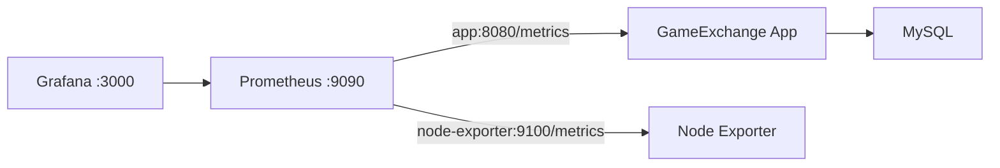

# GameExchange 监控运行手册

## 1. 文档目标

本文档说明如何启动、验证和排查 GameExchange 的本地监控栈。当前范围包括 Micrometer、Prometheus、Node Exporter 和 Grafana，不包括 Alertmanager、集中日志或多节点监控。

## 2. 监控架构



Prometheus 同时加入应用 Backend Network 和 `gameexchange-monitor-network`。Grafana 与 Node Exporter 只加入监控网络。宿主机上的 3000、9090 和开发应用端口均只绑定 `127.0.0.1`。

## 3. 组件和端口

| 组件 | 容器名 | 容器端口 | 宿主机访问 |
| --- | --- | --- | --- |
| GameExchange | `gameexchange-app-1` | 8080 | `127.0.0.1:8080`（可由 `APP_PORT` 覆盖） |
| Prometheus | `gameexchange-prometheus` | 9090 | `127.0.0.1:9090` |
| Node Exporter | `gameexchange-node-exporter` | 9100 | 不发布 |
| Grafana | `gameexchange-grafana` | 3000 | `127.0.0.1:3000` |

## 4. 启动顺序

先启动开发应用和 MySQL：

```powershell
docker compose config --quiet
docker compose up --detach --build
docker compose ps
```

开发 Compose 创建的 Backend Network 名为 `gameexchange_backend`。随后启动核心监控：

```powershell
$env:APP_NETWORK_NAME = "gameexchange_backend"
docker compose -f monitor/docker-compose.monitor.yaml config --quiet
docker compose -f monitor/docker-compose.monitor.yaml up --detach
```

最后启动 Grafana：

```powershell
docker compose -f monitor/docker-compose.grafana.yaml config --quiet
docker compose -f monitor/docker-compose.grafana.yaml up --detach
```

生产 Compose 使用固定网络 `gameexchange-prod-backend`，与监控 Compose 的默认 `APP_NETWORK_NAME` 一致。生产环境不得直接照搬本地端口、凭据或安全组设置，必须同时遵循[生产部署手册](../deployment/PRODUCTION_ECS.md)。

## 5. 指标范围

| 指标 | 类型 | 含义 |
| --- | --- | --- |
| `gameexchange_players_online` | Gauge | 最近 60 秒内具有有效 Lease 的在线玩家数 |
| `gameexchange_trade_total` | Counter | 应用启动后成功完成的购买交易数 |
| `jvm_*`、`process_*`、`system_*` | JVM/进程指标 | 堆内存、GC、线程、CPU 和进程状态 |
| `node_*` | 主机指标 | Node Exporter 提供的 CPU、内存和文件系统状态 |

在线人数采样时如果数据库不可用，Gauge 返回 `NaN`，避免把采集故障错误表示为 0。交易 Counter 是进程内累计值，应用重启后会重新计数；需要跨重启统计时应使用业务数据库记录。

## 6. Grafana provisioning

以下配置会在 Grafana 启动时自动加载：

- `monitor/grafana/provisioning/datasources/prometheus.yaml`：Prometheus 数据源。
- `monitor/grafana/provisioning/dashboards/gameexchange.yaml`：Dashboard Provider。
- `monitor/grafana/gameexchange-business-monitor.json`：包含 11 个面板的业务 Dashboard。

Dashboard 位于 `GameExchange` 文件夹，默认时间范围为最近 6 小时，自动刷新周期为 15 秒。数据源和 Dashboard 均由文件管理，正式修改应提交到仓库，不能依赖 Grafana 数据卷中的人工配置。

## 7. 验证步骤

检查容器：

```powershell
docker ps --filter "name=gameexchange-"
```

检查应用指标：

```powershell
$appPort = if ($env:APP_PORT) { $env:APP_PORT } else { "8080" }
Invoke-WebRequest -UseBasicParsing `
  -Uri "http://127.0.0.1:$appPort/metrics"
```

如果未设置 `APP_PORT`，开发 Compose 默认使用 8080。检查 Prometheus Target：

```powershell
Invoke-RestMethod `
  -Uri "http://127.0.0.1:9090/api/v1/targets"
```

验收时 `gameexchange` 和 `node_exporter` 必须同时为 `UP`。Grafana 健康检查：

```powershell
Invoke-RestMethod -Uri "http://127.0.0.1:3000/api/health"
```

预期数据库状态为 `ok`。登录 Grafana 后，在 `GameExchange` 文件夹打开 `GameExchange Business Monitor`，确认 11 个面板能够显示数据。

## 8. 访问边界

- Prometheus 和 Grafana 端口只允许从本机访问，不应直接暴露到公网。
- 生产 Nginx 对精确路径 `/metrics` 返回 404。
- Prometheus 通过 Docker 服务名 `app:8080` 采集应用，不经过公网入口。
- Node Exporter 没有发布宿主机端口，只能从监控网络访问。
- 当前 Grafana 没有接入企业统一身份系统；生产访问控制应在独立安全步骤中设计。

## 9. 常见故障

### 9.1 Backend Network 不存在

现象：核心监控 Compose 提示外部网络不存在。

处理：先启动应用 Compose，并确认 `docker network ls` 中存在 `gameexchange_backend`；生产环境则确认 `gameexchange-prod-backend` 已由生产 Compose 创建。不要临时创建同名空网络掩盖应用未启动的问题。

### 9.2 gameexchange Target 为 DOWN

依次检查：

1. App 容器是否为 healthy。
2. Prometheus 是否同时加入 Backend Network。
3. 容器内 `app:8080/metrics` 是否可访问。
4. 应用日志中是否存在数据库或指标初始化错误。

### 9.3 Grafana 没有自动加载 Dashboard

检查 Grafana 日志中的 `provisioning.datasources` 和 `provisioning.dashboard`。确认三个 provisioning 文件均以只读方式挂载，并使用已有的数据源 UID 和 Dashboard UID。不要通过删除 Grafana 数据卷处理配置错误。

## 10. 停止服务

停止监控服务但保留数据卷：

```powershell
docker compose -f monitor/docker-compose.grafana.yaml stop
docker compose -f monitor/docker-compose.monitor.yaml stop
```

删除 Volume 会丢失 Prometheus 时序数据或 Grafana 本地状态，执行任何带 `--volumes` 或 `-v` 的命令前必须单独确认。

## 11. 已验证基线

2026-08-07 的本地验证结果：

- Grafana 12.1.0 数据库状态为 `ok`。
- `gameexchange` 和 `node_exporter` Target 均为 `UP`。
- Dashboard provisioning 可在 Grafana 重启后重复加载。
- Dashboard 包含 11 个面板，11 条 PromQL 均执行成功。
- Prometheus、Grafana 和应用端口均只绑定 `127.0.0.1`。
